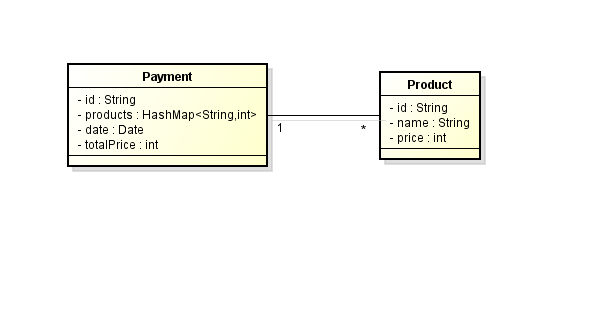
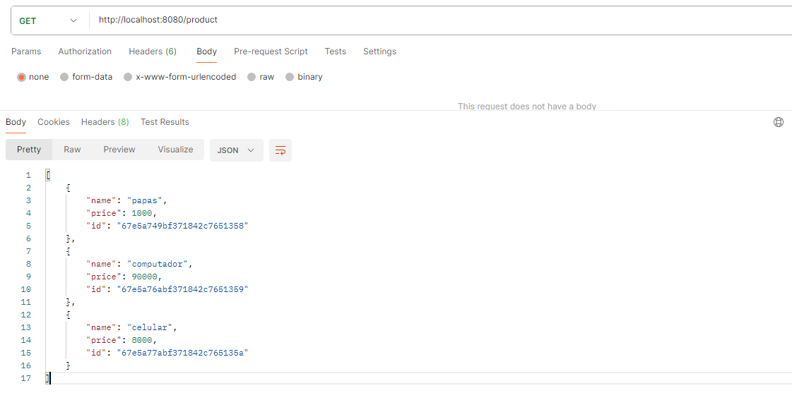

# CVDS_PARCIAL_T2_FRONT

Nuestro modelo será así, tendremos una clase Product y una clase Payment.

Una vez tenemos nuestro BACK funcionando vamos a crear unos productos manualmente ya que en nuestro front no tendremos lugar para crear productos, esto iría en una vista propioa de administrador pero se escaparía del tiempo que tenemos para este examen.

